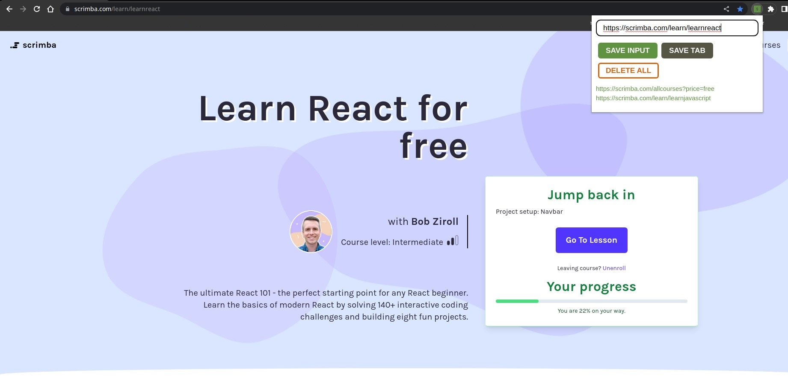

# Leads Tracker - Chrome Extension
The capstone project is a neat Chrome Extension for tracking leads or urls. You will both build and deploy it.

## Table of contents
- [Introduction](#introduction)
- [Overview](#overview)
  - [Screenshot](#screenshot)
  - [Built using](#built-using)
  - [Lessons Learned](#lessons-learned)
- [Author](#author)
- [Acknowledgement](#acknowledgement)

## Introduction
- This is my solution to the third and final part of [Learn JavaScript](https://scrimba.com/learn/learnjavascript).
- This is a chrome extension, with some functionalities such as:
    - Save Input Button
    - Save Tab Button
    - Delete All Button
    - Accessing local storage

## Overview
- Link: [github.com/kierhb/chrome-extension](https://github.com/kierhb/chrome-extension)

### Screenshot

### Built using

- HTML5 markup
- CSS
- Vanilla JavaScript

### Lessons Learned

- Using addEventListener method instead of onclick function.
- Making the input field functional.
- Access local storage.
- Applying template strings.
- Using functions with multiple parameters.
- Thruthy and falsy values.
- Using Chrome API to get the current tab url.
- Deploying chrome extensions.

## Author

- GitHub - [@kierhb](https://github.com/kierhb)
- LinkedIn - [Kier Bobila](https://www.linkedin.com/in/kier-bobila/)

## Acknowledgement
I want to acknowledge one of the co-founders and CEO of [Scrimba](https://scrimba.com), the course instructor Per Harald Borgen and to all members of Scrimba community.